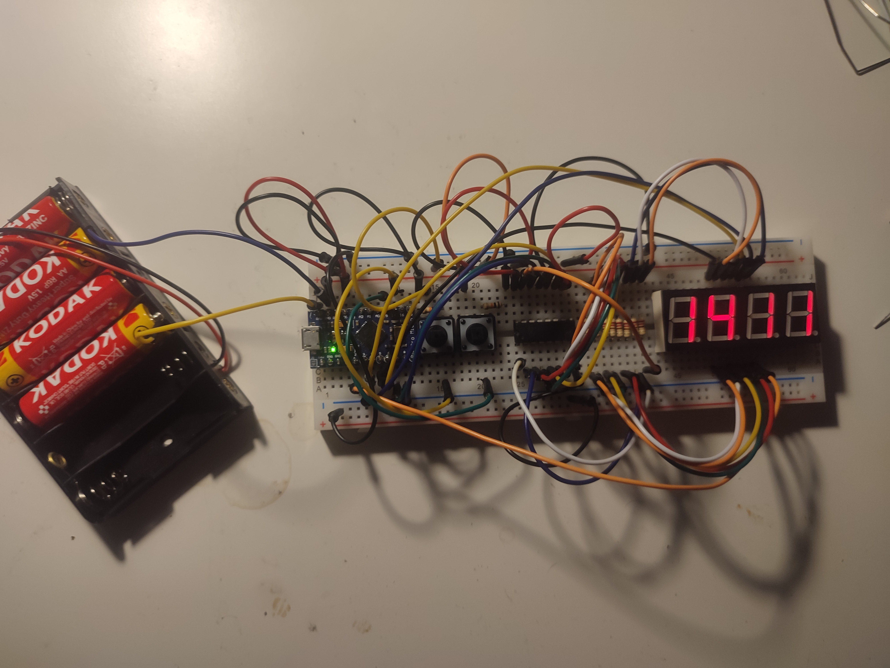

# Programmer's Clock with Arduino

## Overview

This repository contains the code and documentation for a Programmer's Clock, a unique timepiece that displays the current time in hexadecimal format. The project utilizes an Arduino, a 4-digit 7-segment display, 2 buttons, 10 resistors, and a 74HC595 shift register.

## Table of Contents

- [Overview](#overview)
- [Components](#components)
- [Wiring](#wiring)
- [Final Product](#final-product)
- [How to Use](#how-to-use)
- [Contributing](#contributing)
- [License](#license)

## Components

The key components used in this project include:

- Arduino (Arduino Uno recommended)
- 4-digit 7-segment display
- 2 buttons for setting hours and minutes
- 10 resistors
- 74HC595 shift register

## Wiring

To set up the wiring for the Programmer's Clock, refer to the [schematic](./ProgrammersClock.pdf).

## Final Product

After overcoming challenges and refining the code, the Programmer's Clock is ready to display the current time in hexadecimal.

## How to Use

1. Connect the components following the provided wiring diagram.
2. Upload the Arduino sketch from the [code](./arduino-programmers-clock.ino) to your Arduino board.
3. Power on the clock and enjoy the hexadecimal representation of the current time.

## Contributing

Contributions are welcome! If you have ideas for improvements or new features, please open an issue or submit a pull request.

## License

This project is licensed under the [GNU LICENSE](./LICENSE). Feel free to use, modify, and distribute the code for your own projects.
